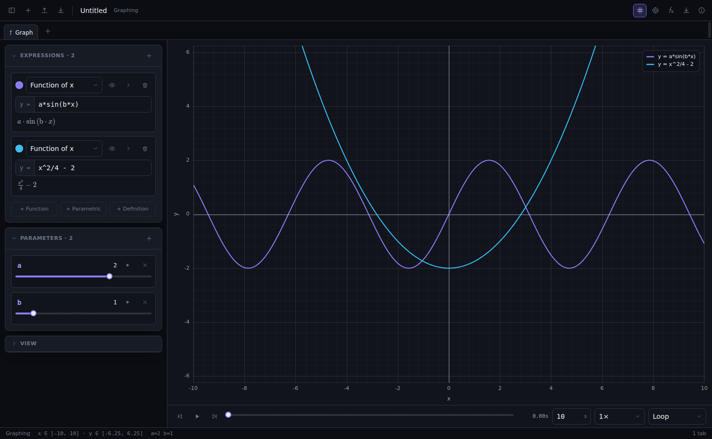
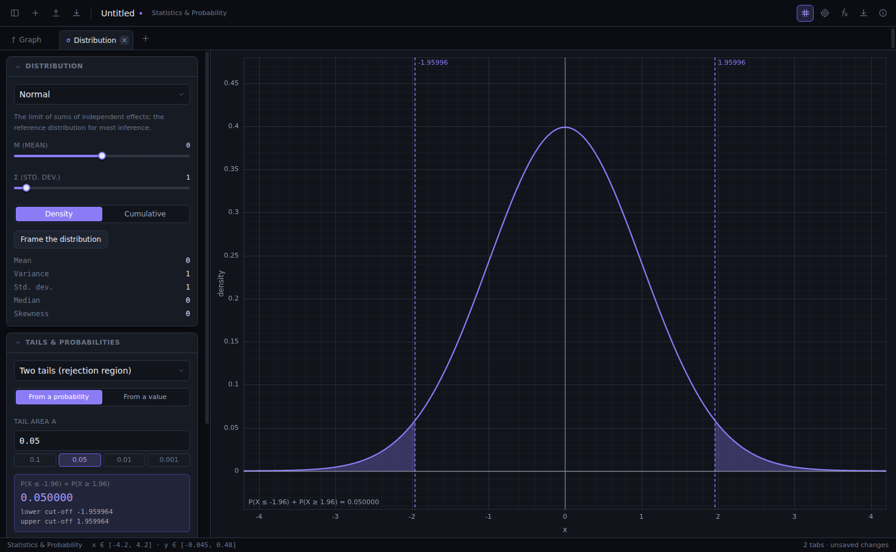
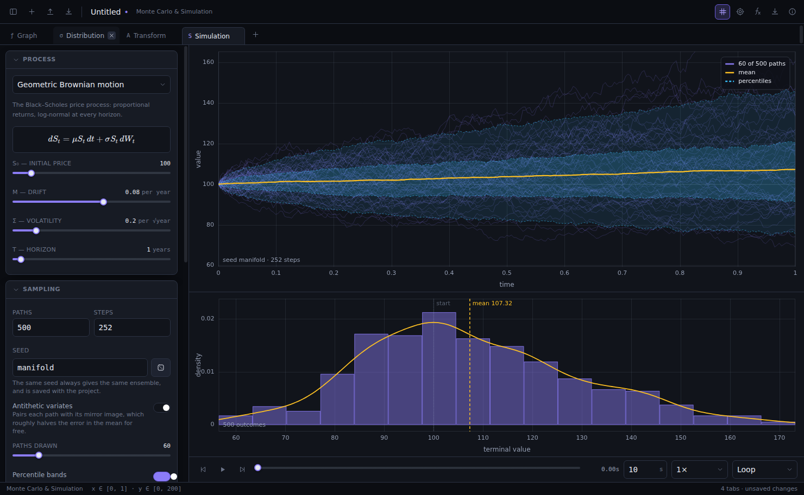
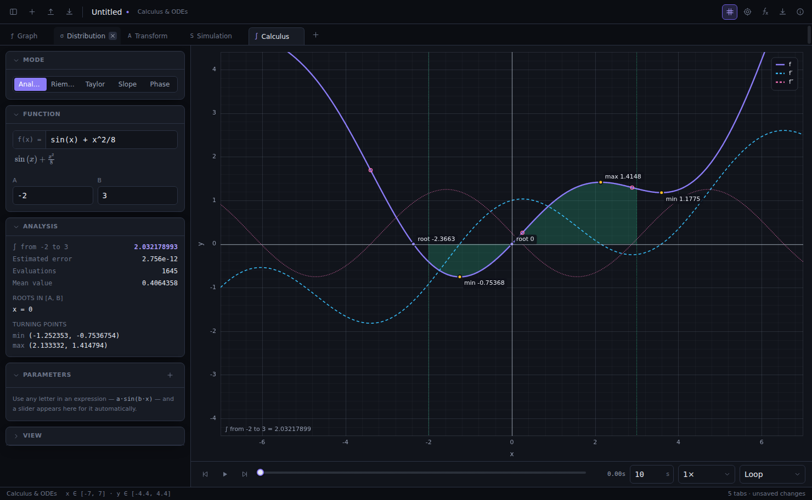
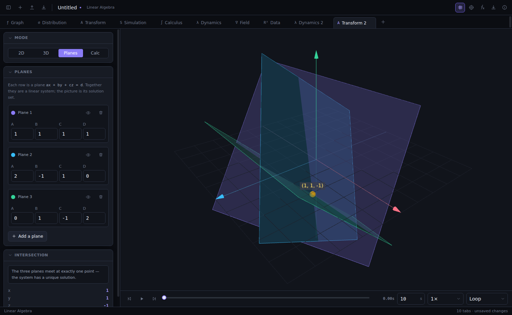
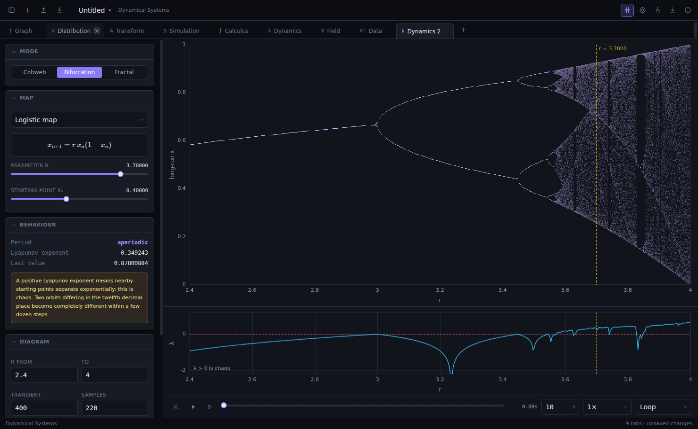
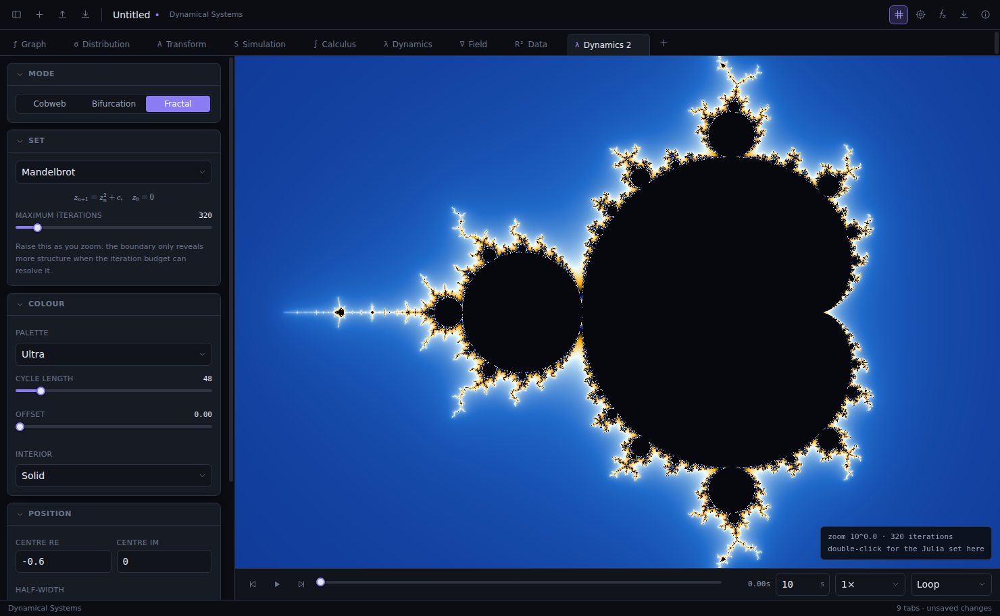
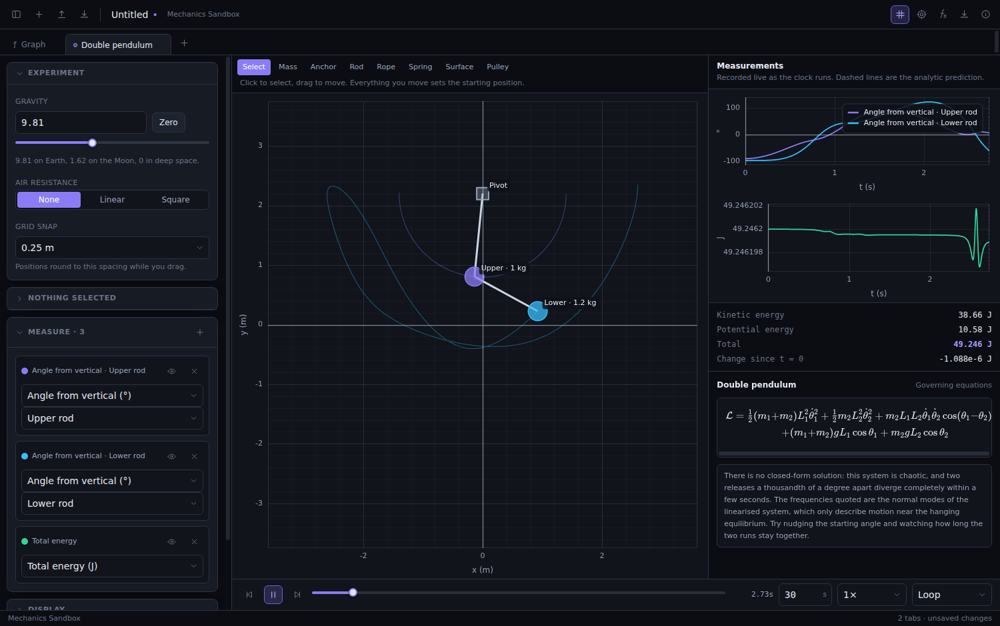
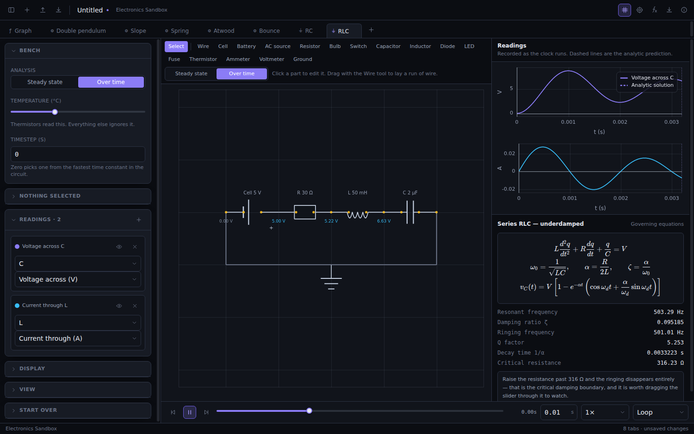

# Manifold

**[Open it in your browser →](https://thomas-j-fish.github.io/manifold/)** — nothing
to install, no account, works on a Chromebook.

A graphing calculator, mathematics workbench and simulation studio, as a
desktop app **and** as a web page. Everything runs on your own machine —
offline, with no account, no telemetry and no subscription. A project file is
plain JSON you can read, diff and keep in git.



---

## Getting started on a Mac

Double-click **`Build Manifold app.command`**.

It installs the dependencies, builds the app, wraps it as `Manifold.app`, and
launches it once to check that it works. When it finishes, drag
`dist-app/Manifold.app` into your Applications folder. After that it opens by
double-clicking, like any other app, with no Terminal window.

The first build takes a few minutes, mostly downloading the Electron runtime.
Later builds take a few seconds.

If you would rather run it from the source while editing, double-click
**`Run Manifold from source.command`** instead, or use `npm start`.

`electron-builder` also works, if you would rather have a `.dmg`:

```bash
npm install && npm run build     # both halves matter — see below
npx electron-builder --mac
```

Note the layout that makes this work. The renderer builds to **`out/renderer`**
and the main process to **`out/main`**, *not* to `dist/` — because `dist/` is
electron-builder's own default output directory, and electron-builder excludes
its output directory from the package it is building. Putting the renderer
there means it is silently dropped, and the app launches into a black window
reading "Not found": the protocol handler's 404, rendered as text. `dist/` is
left free for the installer artefacts, and `package.json`'s `build.files`
lists exactly what belongs in the bundle.

> Manifold is not code-signed with an Apple developer certificate, so the first
> time you open it macOS may say it is from an unidentified developer.
> Right-click the app and choose **Open**, then confirm. You only have to do
> that once. The build script does apply an ad-hoc signature, which is what
> Apple Silicon requires in order to run the app at all.

## On Windows or Linux

```bash
npm install
npm start
```

Everything except the `.app` packaging is cross-platform.

---

## In a browser, with nothing to install

```bash
npm install
npm run build:web       # a static site in out/web
npm run preview:web     # or serve it locally on :4173
```

`out/web` is plain static files — no server, no database, no accounts — so it
can be dropped on any static host. A GitHub Actions workflow
(`.github/workflows/deploy-web.yml`) publishes it to GitHub Pages on every push
to `main`, running the type check and the tests first so a broken build is
never the live one. Turn it on once under **Settings → Pages → Source → GitHub
Actions**; nothing else needs configuring.

Assets are emitted with relative paths, so the same build works from
`example.com/`, from `user.github.io/manifold/`, or from a folder on a memory
stick.

**What changes in a browser.** The application is the same code; only the shell
differs. A web page has no native menu, so File/Edit/View/Tab/Run/Help are drawn
in the window and send the same commands the Electron menu sends. Saving uses
the File System Access API where the browser has one — in Chrome and Edge, Save
writes back to the file you opened, exactly as on the desktop — and falls back
to a download and a file picker in Firefox and Safari.

**Two things the desktop version does not have:**

- **It remembers.** The project is kept in the browser's own storage and comes
  back after a refresh or a closed tab. It is a safety net rather than a save:
  work restored this way is marked unsaved on purpose, because it lives in
  exactly one place nobody chose, and clearing site data deletes it.
- **File → Share as a link.** The entire project is compressed into the link
  itself, so anyone who opens it gets your exact scene — every tab, every
  slider, every component value — with nothing hosted anywhere. The project
  travels in the URL *fragment*, which browsers never send to the server, so
  even a hosted copy of Manifold never receives what anyone built. A recipient
  gets their own copy; their changes do not come back to you.

There is no sign-in, and that is a design decision rather than a missing
feature. Accounts would mean a server, a database, personal data, and — since
this is aimed at students — the whole of the ICO's Children's Code. Local
storage plus a shareable link covers what accounts would have been used for,
for nobody's data and nobody's money.

---

## What is in it

The workspace is a set of tabs. Each tab is an independent canvas with its own
mode, viewport, expressions, parameter sliders and clock, and the whole
workspace saves to a single `.manifold` file.

### Starting a tab

The **+** at the right-hand end of the tab strip — or **⌘T**, or **Tab → New
Tab** — opens a picker listing all ten modes with a line of description each.
Pick one and that tab opens configured for it: a Monte Carlo tab arrives with
GBM already set up and a seed, a Statistics tab with a standard normal framed
and its tail controls ready, a Linear Algebra tab with the identity matrix and
the transformation slider at zero. From there you change what you want. That is
the whole of "creating a project from scratch" — the examples under **Help →
Load an Example** are the same tabs with their fields filled in, so opening one
next to a blank tab of the same mode shows exactly which fields carry the idea.

The **+** in the toolbar does the same thing. **New Project** (**⌘N**, or
**File → New Project**) is the different one: it clears the workspace and starts
over, and it asks before discarding anything unsaved.

### Universal to every tab

**Expressions.** Type ordinary notation — `a*sin(b*x)`, `2x + 1`, `sqrt(x^2+1)`
— and see it typeset underneath as you go. Pasted LaTeX is converted
automatically, so `\frac{x}{2}` and `\sin\left(x\right)` both work. Around 90
functions are available; the `ƒ` button in the toolbar lists them all.

**Parameter sliders.** Use any letter you have not defined and Manifold offers
to make a slider for it. Drag it and every dependent plot redraws immediately.
Each slider can also be handed to the timeline, with its own sweep period and
direction, so several parameters can animate against one clock at different
rates.

**A shared clock.** Play, pause, scrub, loop or ping-pong. It drives parameter
sweeps, the matrix interpolation, particle advection, PDE playback, the Riemann
subdivision count and the Taylor order — everything animatable in the tab moves
against the same timeline.

### The ten modes

| | |
|---|---|
| **Graphing** | Functions, parametric curves, polar curves, implicit relations and shaded inequality regions. Optional overlays for the derivative, a shaded definite integral, and automatically located roots and turning points. |
| **Statistics & Probability** | Twenty distributions with exact densities, cumulative functions and quantiles. Shade a tail from a probability to get the critical value, or from a value to get the p-value — and drag the shaded edge directly on the plot. Paste sample data for a histogram, a kernel density estimate and t-, z-, correlation and normality tests. |
| **Linear Algebra** | A transformation sandbox that interpolates from the identity while the grid, unit square, basis vectors and eigenvectors deform with it. A 3D version of the same. Planes plotted in space with their exact line or point of intersection computed and classified. A matrix calculator with determinant, inverse, rank, RREF with steps, and eigenvalues. |
| **Monte Carlo & Simulation** | Geometric Brownian motion, Ornstein–Uhlenbeck, Merton jump diffusion, Heston stochastic volatility, a random walk, and any SDE you write yourself. Percentile fan charts, terminal distributions, convergence plots, VaR and expected shortfall, barrier probabilities, antithetic variates — all from an explicit seed saved with the project, so every run is reproducible. |
| **Calculus & ODEs** | Derivatives, second derivatives, adaptive-quadrature integrals, Riemann sums under five rules with the error against the exact value, Taylor series to order 20, slope fields with integral curves, and phase portraits with nullclines and classified equilibria. |
| **Dynamical Systems** | Cobweb diagrams for five iterated maps with fixed points marked stable or unstable, orbit diagrams with a Lyapunov exponent strip underneath, and smooth-coloured Mandelbrot, Julia, Burning Ship, Tricorn and Multibrot sets. Double-click the Mandelbrot to get the Julia set for that point. |
| **Vector Fields & PDEs** | Arrow grids, streamlines and animated particle advection over any field you type, with divergence, curl and magnitude available as a background. The heat and wave equations on a line, solved by finite differences with automatic CFL substepping and played back over time. |
| **Data & Regression** | Import or paste a CSV. Fit a line, a polynomial to degree 10, or one of six nonlinear families by Levenberg–Marquardt. Standard errors, p-values, R², adjusted R², RMSE, AIC, BIC, a delta-method confidence band and a residual panel. |
| **Mechanics Sandbox** | Build an experiment from masses, anchors, rigid rods, ropes, springs, ramps and pulleys, then run it. Constraints are solved with Lagrange multipliers, so the tension in a rod and the normal force under a block are exact readouts rather than estimates. Record any quantity live — angle from vertical, extension, tension, normal and friction force, energies — and read the governing equation beside the chart. |
| **Electronics Sandbox** | Wire up cells, resistors, bulbs, switches, capacitors, inductors, diodes, LEDs, fuses, thermistors and meters on a grid. Solved by modified nodal analysis with companion models for the reactive parts and Newton–Raphson for the junctions — the same method SPICE uses. Watch the current flow, colour the wires by potential, and plot any voltage, current, power or charge against time. |

**Help → Load an Example** opens twenty-four worked examples in a new tab, from
Lissajous figures to the Heston model to the logistic map's route to chaos to a
double pendulum that never repeats itself.

#### The two sandboxes

Both work the same way. The left half is a bench you build on; the right half is
the instruments watching it. Pick a piece from the toolbar, click to place it,
select it to set what it is made of, then press play.

Everything you build is the state at **t = 0**, so moving a mass or changing a
resistor rewinds the clock and recomputes the run from the beginning. That is
what makes the timeline scrubbable: the trajectory is a deterministic function
of the scene, so dragging back to two seconds shows exactly what it showed the
first time. A live stepper could not promise that, and a measurement you cannot
return to is not a measurement.

The **governing equations** panel underneath the chart names the arrangement if
it is one of the standard ones — a simple pendulum, an Atwood machine, a series
RLC — and prints the equation, the derived quantities and, where a closed form
exists, a dashed curve over the simulated trace. Watching those two part company
is the point: release the pendulum past twenty degrees and the small-angle
prediction visibly drifts out of step, which is the sin θ ≈ θ approximation
failing in front of you. Where no standard form applies, the panel says so and
gives the general statement instead of a formula that nearly fits.

What the mechanics engine deliberately does not do: bodies are point masses
rather than rigid bodies, so a rod is a massless constraint between two masses
and a compound pendulum is built as a chain; and a body rests on one surface at
a time, not wedged into a corner between two. Both limits are stated because
knowing where a model stops is part of using it.

| | |
|:--:|:--:|
|  |  |
| Interactive tails and exact critical values | Fan charts and terminal distributions |
|  |  |
| Derivatives, integrals and critical points | Planes meeting at a computed point |
|  |  |
| The route to chaos, with its Lyapunov exponent | Smooth-coloured escape times |
|  |  |
| A pendulum, and where the small-angle formula fails | An RC circuit charging, beside τ = RC |

---

## How it works

A few decisions are worth knowing about if you plan to read or change the code.

**Expressions are compiled, not interpreted.** math.js does the parsing — it is
excellent at it — but its evaluator costs a few microseconds per call, which is
an order of magnitude too slow for 4000 points redrawn while a slider is
dragged. `src/core/math/compile.ts` walks the parsed tree once and builds a tree
of JavaScript closures with every variable already resolved to an array index.
That is roughly 20–40× faster.

It is deliberately *not* `new Function` on a generated string. Codegen would be
a little faster still, but it would force `script-src 'unsafe-eval'` into the
app's Content-Security-Policy for the sake of a few percent. Closures need no
such exemption, so the renderer keeps a strict policy — and the built app
asserts that at startup by checking that `eval` genuinely throws.

**The renderer is served over a custom scheme, not `file://`.** A `file://`
document has an opaque origin, which breaks ES modules, module workers and any
meaningful CSP all at once. `electron/protocol.ts` registers `app://manifold`
as a standard, secure scheme and serves the built assets from it, so the window
behaves the way a web page does.

**Plots are sampled in screen space.** Uniform sampling wastes points on the
flat parts of a curve and still misses the corner of a cusp, and it cannot tell
a steep segment from a vertical asymptote — which is why so many plotters draw
`tan(x)` joined across its poles. `src/core/math/sampling.ts` refines wherever
the polyline visibly bends and uses three independent signatures to decide
whether a jump is a pole, a step discontinuity, or just a steep line.

**Statistics are computed, not approximated.** Every distribution supplies its
density, cumulative function and quantile as three separate implementations
rather than deriving the last two numerically. That is more code and it buys
accuracy where it matters: a tail probability of 1e-12 comes out right, which is
exactly the regime a p-value lives in.

**Long computations are sliced, not blocked.** A full-window Mandelbrot at high
iteration counts is hundreds of millions of operations. Rather than move it to
a worker — which would mean serialising the palette, the parameters and the
buffer, plus a second copy of the maths — it is cut into slices sized to a
per-frame time budget that adapts to whatever the machine managed last frame.
The picture appears progressively and the interface never stops responding.

**Randomness is seeded.** Nothing calls `Math.random`. Every stochastic path
comes from xoshiro128\*\* seeded by a string saved in the project file, so
reopening a project and pressing play gives back the identical ensemble.

---

## Layout

```
electron/            main process — window, menu, IPC, custom protocol, self-test
src/
  core/
    math/            the mathematics, with no UI dependencies at all
      compile.ts       expression → closure tree
      specfun.ts       gamma, beta, erf, incomplete integrals, normal quantile
      distributions.ts twenty distributions, exact pdf/cdf/quantile
      stats.ts         descriptive statistics, histograms, KDE, hypothesis tests
      linalg.ts        LU, QR, RREF, eigenvalues, plane intersections
      numeric.ts       quadrature, root finding, RK4, Dormand–Prince
      sampling.ts      adaptive plot sampling, marching squares
      simulate.ts      SDE ensembles, quantile bands, risk measures
      fitting.ts       least squares, Levenberg–Marquardt, CSV parsing
      fields.ts        vector fields, streamlines, heat and wave equations
      fractals.ts      escape-time sets, orbit diagrams, Lyapunov exponents
      random.ts        seeded xoshiro128** and the variate generators
    store.ts         the whole document, in one zustand store
    serialize.ts     the .manifold format, with forgiving migration
  plot/scene.ts      declarative 2D scene description and its canvas renderer
  modes/             one panel + one surface per tab mode
  components/        shell, controls, inputs, plotting surfaces
out/
  main/              compiled main process        (git-ignored)
  renderer/          compiled interface           (git-ignored)
tools/
  make-app.js        wraps the build as a macOS .app bundle
  smoke.js           drives the real app through every mode and screenshots it
tests/               numerical and document-format tests
```

## Development

```bash
npm run dev          # Vite dev server on :5273
npm start            # build, then launch Electron
npm test             # 85 numerical, format and rendering tests
npm run typecheck    # both tsconfigs
npm run smoke        # end-to-end: launches the app, drives every mode
npm run make-app     # build the macOS bundle (macOS only)
npm run clean        # remove out/, dist/ and dist-app/
npm run icon         # regenerate the icons from build/make-icon.py
```

The test suite checks results against closed forms, published tables and
identities that must hold exactly — never against what the code happened to
print. `npm run smoke` launches the real application, visits every mode, asserts
that each canvas actually painted something, and leaves a screenshot of each in
`test-shots/`. On Linux it needs a display: `xvfb-run -a npm run smoke`.

Building the macOS bundle runs a third layer: `tools/make-app.js` launches the
app it has just packaged with `MANIFOLD_SELFTEST` set, and the app runs thirteen
checks on itself from inside the bundle — that the renderer mounted, that the
preload bridge is exposed, that the plot actually painted, that the stylesheet
and maths fonts were found at their repackaged paths, and that `eval` genuinely
throws, which is how the strict Content-Security-Policy is asserted rather than
assumed. If any of them fail the build stops and says which.

## Licence

MIT. See [LICENSE](LICENSE).

---

## How this was built

Manifold was written with Claude, working from my specification. I designed the
product, chose what should be in it and how each part ought to behave, set the
standard that every piece of mathematics be tested against a closed form rather
than against recorded output, and tested and verified the result. I did not
type the code line by line, and it seems worth saying so plainly rather than
leaving anyone to wonder.

What that means in practice: the physics and the numerics are checked against
textbook results — the exact large-amplitude pendulum period via the elliptic
integral, `2m₁m₂g/(m₁+m₂)` for an Atwood machine, `g(sin α − μ cos α)` on a
slope, a hand-solved Wheatstone bridge, RC, RL and RLC time constants, a
bisection-solved diode operating point. Every one of those tests was checked to
fail when the corresponding physics was deliberately broken, because a test
that passes against a bug is worse than no test at all.

## Licence

MIT — see [LICENSE](LICENSE). Use it, change it, teach with it, sell something
built on it. It comes with no warranty: it is a teaching and exploration tool,
not a certified instrument, and nothing in it should be the last word on a
result that matters.
